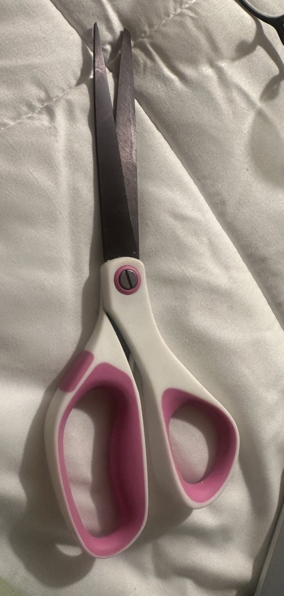
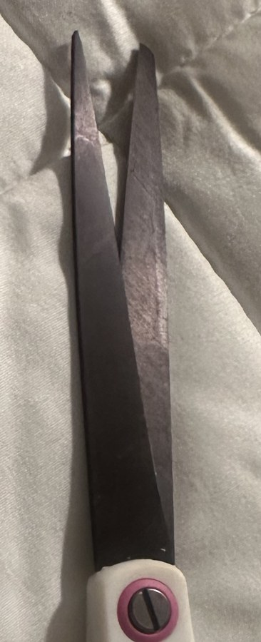
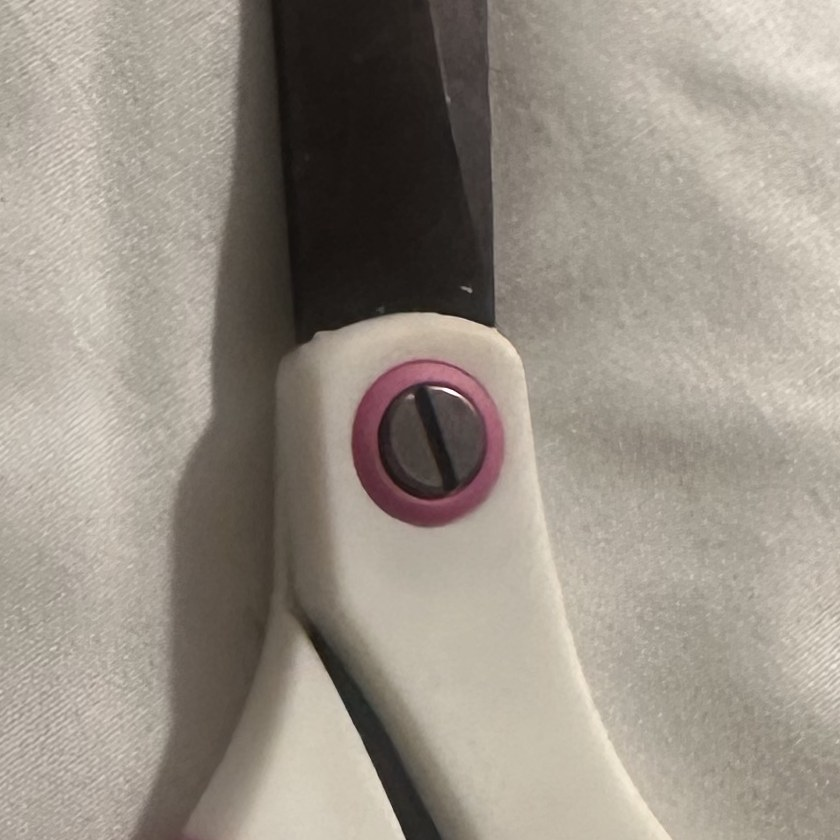
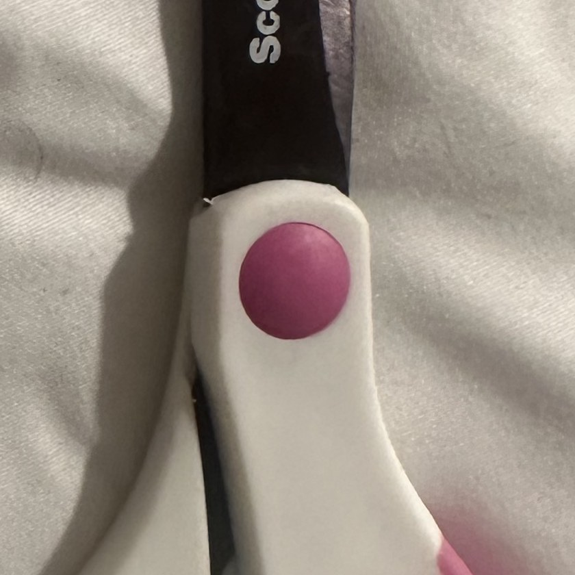
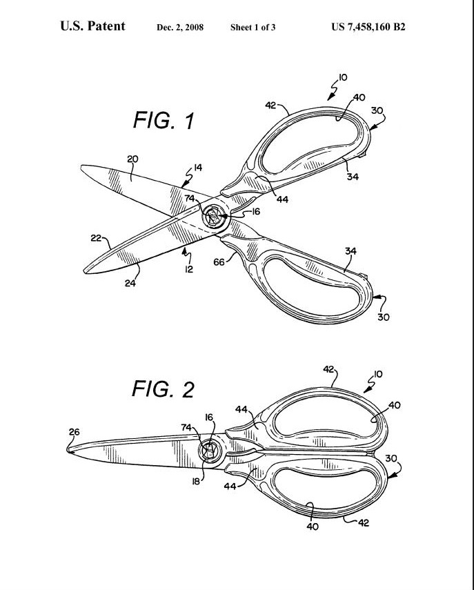

# A1 – Portfolio Construction and Product Analysis

## Objective

Set up a working engineering portfolio, then use it to do the three things every later assignment in
this course asks for: figure out the right model for a problem and say what makes it valid
(*Analyze*), pick between options and say why (*Decide*), and write it up so someone else can follow
it without asking me questions (*Communicate*).

**Deliverable:** this site, at
[shamardlindo1.github.io/-megr2157-portfolio](https://shamardlindo1.github.io/-megr2157-portfolio/).

---

## Decide — three documented decisions

### Decision 1 — Homepage identity

The homepage is for the grader and the recruiter. The first is the grader, who arrives needing to
locate a specific assignment and look at the standard. The second is a recruiter, who arrives at the
website from my resume link. Both readers need the same three facts before anything else: what the
portfolio contains, which is eleven assignments; how each assignment is organized; and what standard
the record holds itself to. Biography is not included at the top of the page and sits in the About Me
section below the fold. That matters because the reader sees what the document is before seeing who
wrote it, which gives them the context to judge it.

### Decision 2 — One intentional customization: navigation labels

**What I changed.** In `mkdocs.yml`, the sidebar links for assignments were just `A1` through `A11`.
I changed them to include the subject, like `A1 — Portfolio & Product Analysis`.

**What it fixes.** Task A defines navigability as finding a specific piece of work in under 60
seconds. `A5` by itself tells you nothing. If you are looking for the bending stiffness work, you
have to open pages one at a time until you hit it — up to eleven page loads. With the subject in the
label, the sidebar *is* the index, and you find it in one look instead of one search.

**Why the default did not work.** Plain numbers stay the same across every student's portfolio in
the class, which helps a grader jumping between them. That is optimizing for sameness across sites.
It does nothing for one person reading this site looking for a topic. Where those two pull against
each other, I am building for my reader.

### Decision 3 — My documentation standard

> Every assignment on this site will state the governing model and its variables, the numbers and
> units I used, the assumption that makes the model valid, and the option I rejected along with the
> reason I rejected it — so a reader can redo my work and argue with my choice without having to ask
> me anything.

---

## Analyze

### Task A — Portfolio analysis

I looked at two engineering portfolios against the four requirements. The first one is on GitHub,
and I picked the second one on a different platform so I had something to compare it to.

#### Portfolio 1 — Artem Gomov (GitHub Pages)

[artemgomov.github.io](https://artemgomov.github.io/). He is a mechanical engineering senior at
Virginia Tech and most of his projects are Formula SAE parts.

**a. Navigability.** He has seven projects listed right on the front page, each one a link with a
date and the name of the part, like "2024 Internal Combustion Front Chassis Shock Mounts." I could
find any of them in one click. There is no search bar and no index, and once you open a project the
only link out is "Back to projects." That works for seven projects but it would stop working if he
had fifty.

**b. Reproducibility.** He lists the material, the machine, the vise, the collets and every endmill
by part number, plus which version of NX and Ansys he used. But he never gives a single dimension,
and there are no drawings or CAD files to download. I could set his machine up exactly the same way
and still not know what shape to cut.

**c. Evidence of reasoning.** This is his weakest area. His FEA page says he pulled forces off
strain gauges but never says what the forces were or what stress came out. He lists the brake parts
he picked without saying what else he looked at. He does say he moved the wheel speed sensors to
reduce rotating mass, but he never says how much mass it saved, so I just have to take his word for
it.

**d. Professional tone.** It reads like a resume, which I think is on purpose. I did not find typos
anywhere I looked. Two things do stand out: one page shows raw markdown in a caption that prints as
`***Final Result**`, and another page still has placeholder images in it. Everything is written as
what he was responsible for instead of what the result actually was.

#### Portfolio 2 — Teddy Warner (personal site, MkDocs)

[theodore.net](https://theodore.net/). Around 21 projects, mostly machines and electronics he built
himself.

**a. Navigability.** Every page has a table of contents down the side and the search bar actually
works, so I could jump straight to a section instead of scrolling for it. It takes two clicks to
reach a project instead of one. His labels do not agree with each other though — the top says
"Writings" and the side says "Writing" — and some project names like "Quote Receipts" and "Tone" do
not tell me what they are.

**b. Reproducibility.** This is the strongest part of either site. On his aquaponics project he
lists every resistor and capacitor value, the microcontrollers by part number, the pump, and a link
to download all his files. He also writes his assumptions down instead of hiding them — plants need
10 to 14 hours of light, so he picked 12. What is missing is version numbers on his software and a
parts list.

**c. Evidence of reasoning.** He says why he picked things. He used a fixed voltage regulator
instead of an adjustable one because his board is always 5 V. He also writes down what went wrong,
seven board revisions worth, including blowing a regulator by soldering in the wrong part. I can
follow how he got there. What I cannot do is check him, because he never compares his options with
numbers.

**d. Professional tone.** This is where it falls apart. He writes "due to me being stupid" and "This
error sucked," and there is an emoji in there. He misspells words in his headings ("Reasearch,"
"Itteration") and even inside one of his URLs, which he cannot fix now without breaking every link
pointing at that page. He also sells products in the same sidebar, so it reads partly like a store.

### Task B — Product analysis: Scotch™ Titanium scissors

*Figure 1 — Assembly, front face. The slotted pivot screw sits in the pink collar, sunk into a raised
boss on the handle.*

#### a. Primary function

Stated as an engineering function instead of a consumer one:

> The device turns a squeezing force applied at two handle loops into a concentrated shear force at a
> moving contact point between two opposed cutting edges, cutting a thin sheet along a path the
> operator chooses, while holding both halves to a single rotation about a fixed pivot axis.

Two things make "it cuts paper" the wrong description. First, it does not **split** material the way
a knife does — it **shears** it. The two edges never actually meet; they slide past each other with
almost no gap, and the sheet fails in shear across that gap. Second, the contact point moves. It
travels from the tips toward the pivot as the blades close, which is why the mechanical advantage
changes during the cut.

#### b. Governing model

Two things govern how these scissors work: a moment balance that decides how much force reaches the
material, and a shear criterion that decides how much force the material needs before it gives.

##### i. The model and its variables

The first half is a class-1 lever. Both halves rotate about one fixed pivot, so taking moments about
that axis gives `F_blade · a = F_hand · b`, which rearranges into a mechanical advantage of
`MA = F_blade / F_hand = b / a`. In that expression `F_hand` is the force I put into the handle loop,
in newtons; `b` is the distance in meters from the pivot out to where that force acts; `F_blade` is
the force delivered at the cutting point, in newtons; and `a` is the distance in meters from the
pivot out to wherever the two edges are touching at that instant. The part worth noticing is that
`a` is not a fixed number. The contact point slides toward the pivot as the blades close, so `a`
shrinks as the cut goes on and `MA` climbs while it does. That is what the model actually predicts,
and it is why thick material has to be cut back near the pivot and why trying to cut it at the tips
stalls.

The second half is what breaks the material, and it is direct shear. The sheet fails once the shear
stress reaches the material's ultimate shear strength, `τ = V / A_s >= τ_ult`. Here `V` is the shear
force pushed across the sheet in newtons, which is essentially `F_blade`; `A_s` is the sheared area
in square meters, equal to the sheet thickness `t` times the length of edge actually in contact
`l_c`, so `A_s = t · l_c`; and `τ_ult` is the ultimate shear strength of whatever is being cut, in
pascals. Putting the two halves together, the sheet cuts when `(b / a) · F_hand >= τ_ult · t · l_c`
— the hand force multiplied by the lever ratio has to beat the material's strength multiplied by the
area being sheared.

##### ii. One assumption that makes the model valid

The whole thing rests on the side gap between the two blade faces, call it `c`, staying small
compared to the thickness of the material being cut, `c << t`. As long as that holds, the sheet is
loaded in almost pure shear across one plane, and `τ = V / A_s` is the right criterion to use. If
that gap opens up — a loose pivot screw, or a blade flexing sideways under load — the sheet stops
being sheared and starts being bent and dragged down into the gap instead. The loading becomes
bending plus tension rather than shear, `A_s` stops meaning anything, and the model no longer
predicts when the material will fail. That one assumption is the entire reason the pivot screw
exists as a load-carrying part, and it is why a loose pair of scissors folds paper instead of
cutting it.

#### c. Components and how their geometry sets their function

**Components 1 and 2 — the two blade-handle halves**

*Figure 2 — Blade profile and pivot. The section is thickest where the blade meets the pivot and
tapers toward the tip.*

The blade is thickest at the tang, where it enters the handle, and thins toward the tip. That is not
styling. The cutting force `F_blade` acts some distance out from the pivot, and the bending moment it
creates inside the blade is biggest at the pivot end. So the material is put where the moment is
biggest, which keeps the blade from flexing and keeps the side gap `c` small. A blade that was thin
all the way along would bend under the same load, break the `c << t` assumption, and fold the paper
instead of cutting it.

The two inside faces are ground with a slight relief so the edges touch at a **point** instead of
along a line. Two things follow from that. First, the contact length `l_c` stays small, so for a
given `F_hand` the shear stress `τ = V / (t · l_c)` is as high as possible — all of the hand force
gets concentrated into the smallest area it can be. Second, that point slides along the edges as the
blades close, so the sheet gets cut a little at a time instead of all at once. Without the relief,
closing the scissors on a sheet would take a force proportional to the entire contact length, which
is roughly a hundred times more.

The tang also bends out of the blade plane, so the handles sit off to one side of the cutting plane.
That lets your hand clear the table while `F_hand` still acts roughly in the plane the blades rotate
in, which is the condition the moment balance above assumes.

*Figure 3 — Handle loops. A hard white shell forms the structure of each loop; a soft pink material
lines the inside where your fingers press. Note the raised pink pad on the outer edge of the bigger
loop, and that the two loops are different sizes.*

Each handle loop is made of two materials. The hard outer shell carries the load from your fingers
into the tang and sets how stiff the loop is. The soft lining sits exactly where your fingers touch.
What that does is change contact pressure, `p = F / A`. A soft layer squashes under load, so the
contact patch grows as the force grows, which means peak pressure climbs slower than the force does.
On a hand tool like this the thing that usually stops you is your fingers hurting, not your hand
being weak — so making the contact patch grow under load raises how hard you can actually squeeze
without changing the lever geometry at all.

The two loops are different on purpose. The smaller round one takes the thumb, which is one finger
and a roughly round contact patch. The bigger oval one takes two or three fingers and gets a longer,
narrower patch. The shapes match the loads they actually see; a matched pair would make one loop too
big and the other too small. The raised pink pad on the outside of the bigger loop is a rest that
takes the sideways part of your grip — the part the in-plane lever model above assumes away.

**Component 3 — the pivot screw**

*Figures 4 and 5 — Pivot screw, front and back. Slotted head in a collar, sunk into a raised boss on
the front; domed cap on the back.*

The pivot is the part that enforces the assumption the whole model rests on. It sets the single
rotation the blades are allowed, and more importantly it sets the clamping force that holds the two
blade faces together, keeping `c << t`. It is carrying load, not just holding two pieces together.

Three choices are visible in it. The head is **slotted** instead of riveted, so the tightness can be
adjusted later — as the faces wear and the gap opens up, you can tighten it back to the condition
the model needs instead of throwing the scissors away. The head is **sunk into a raised boss** so it
sits below the handle surface, where it cannot press into your hand or snag the material feeding
past. And the **boss itself is extra thickness** added exactly where the hole takes material away —
putting material back at the stress concentration around the hole, in the area already carrying the
biggest bending moment.

#### d. Patent research

**Patent:** **US 7,458,160 B2** — *"Ergonomic handle for scissors and other tools."*
**Inventors:** Juan Carlos Escobar, Justin John Adelff, Dino Anthony Mariano.
**Assignee:** Helen of Troy Ltd (later assigned to Kaz Europe SÀRL).
**Filed:** 7 November 2005. **Granted:** 2 December 2008.
[patents.google.com/patent/US7458160B2](https://patents.google.com/patent/US7458160B2/en)

*Figure 6 — US 7,458,160 B2, Sheet 1 of 3. FIG. 1 shows the scissors open and FIG. 2 shows them
closed. Item 40 is the resilient segment over-molded onto the rigid handle segment 42, and item 74 is
the pivot. Drawing from the published patent (USPTO / Google Patents).*

Claim 1 describes "first and second opposing lever members coupled together at a pivot point," each
with a cutting blade and a handle loop having "an inner loop surface, an outer loop surface, and a
hollow cavity," where the handle is made of "a rigid segment and a resilient segment," the resilient
one "over-molded to the rigid segment."

I could not find a patent assigned to 3M for this exact product. US 7,458,160 B2 is the patent that
claims the construction I can see in Figures 1–5, so these scissors belong to that family rather
than being proven to be that exact claim.

##### i. Two alternatives that do the same job

The job is *cutting thin sheet material along a path the operator picks*.

**Rotary cutter.** The rotary cutter is a round blade on a handle that gets rolled across the
material, and it sits on a self-healing mat. Same failure mode, but one blade goes against a backing
instead of two blades passing each other the way the scissors do. It cuts long straight lines that a
scissor stroke cannot, and the force stays constant the whole way. The cost is the mat it needs
underneath, so it cannot cut material that is not supported. It also cannot cut tight curves or
holes in the middle of the page.

**Guillotine trimmer.** The guillotine trimmer is one long blade pinned at one end that swings down
and shears the sheet against a fixed edge on the bed. Same failure mode as the scissors, two edges
passing each other, but the blade is longer and the pivot sits much further from where the hand
pushes, so the mechanical advantage is far higher than anything I can get by hand. It gives a
repeatable straight edge every time because the sheet is registered against the bed. The cost is
that the machine decides the path and I do not, so it only does the job when the cut is straight and
runs off an edge. It cannot follow a curve or start a cut in the middle of a sheet.

##### ii. One design decision, and why I think they made it

**The decision:** the handle loop was made a hollow shell with a soft over-molded surface where your
fingers go, instead of one solid hard loop. I can see it in Figure 3, and the patent claims it
directly — a "hollow cavity" in the loop with a resilient segment over-molded onto a rigid one.

**Why I think they did it.** What limits a tool like this usually is not how strong your hand is —
it is how much pressure your fingers will put up with before you let go. All of `F_hand` goes in
through a small patch on one or two fingers, so on a solid hard loop the pressure `p = F / A` is set
by a fixed area and climbs straight up with the force needed. The tougher the material, the more
likely you let go before it cuts. Making that surface soft and backing it with a void lets the
contact patch spread out as the load goes up, so `A` grows with `F` and the peak pressure climbs
more slowly. The requirement it satisfies is *how hard you can actually squeeze before it hurts*,
and it satisfies it without touching the lever, the blade, or the steel — which is what makes it a
cheap change to make.

---

## Communicate

Part 3 is answered in the **[About Me](../../index.md#about-me)** section on the homepage, as the
brief requires: name, introduction, the answer to *"what does it mean to defend an engineering
decision — and do you currently know how to do it?"*, and time spent.

### Sources

- Artem Gomov, engineering portfolio — <https://artemgomov.github.io/>
- Teddy Warner, engineering portfolio — <https://theodore.net/>
- Escobar, J. C., Adelff, J. J., & Mariano, D. A. *Ergonomic handle for scissors and other tools.*
  US Patent 7,458,160 B2, granted 2 December 2008 —
  <https://patents.google.com/patent/US7458160B2/en>
