# A2 – Truss Stress Analysis

## Objective

Design a lightweight planar truss in A500 structural steel, size its members against
yield with a safety factor of 3.5, and size the hardened tool steel pins that join it
against shear with a safety factor of 4. Every element shares one cross-section and
every pin shares one diameter, so the whole design is set by the single largest force
in the structure and the single largest load on a pin.

Given: `a` = 0.4 m, `b` = 0.3 m, point A is a pin and point B is a roller, and the load
`P` is mine to choose anywhere from 20 to 30 kN.

I chose P = 25 kN. My first instinct was 20 kN, because a smaller load means smaller
members and a lighter truss, and weight optimization is part of the grade. Then I decided
that was gaming the problem rather than solving it — the weight credit is for choosing an
efficient geometry and section, not for picking the smallest number I was allowed to pick.
25 kN sits mid-range and keeps the design honest. I also carried every equation
symbolically before substituting, so swapping the load later would only change the last
line of arithmetic.

---

## Analyze

### Deciding how many members the truss needs

The figure fixes four joints but not the members, so the first thing to settle was how
many members are required. For a statically determinate, rigid planar truss:

```
m + r = 2j
m + 3 = 2(4)
m = 5 members
```

Four joints, three reaction components from a pin and a roller, so five members.

There are six possible connections between four joints, so choosing five means leaving
exactly one out. Working through the options, most of them put two members physically
crossing in the middle of the truss, which cannot be built. Dropping one of the two long
diagonals is the only choice that gives a buildable truss. I dropped BD, which leaves
AB, BC, CD, DA and the diagonal AC. Dropping AC instead gives the mirror image with
identical forces.

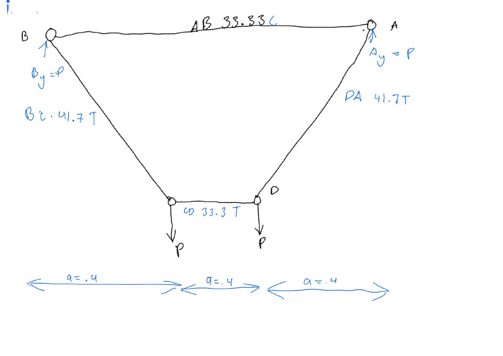

### Support reactions

Before touching any joint I treated the whole truss as one rigid body. Taking moments
about A was the efficient move, because both unknowns at A pass through that point and
drop out of the equation.

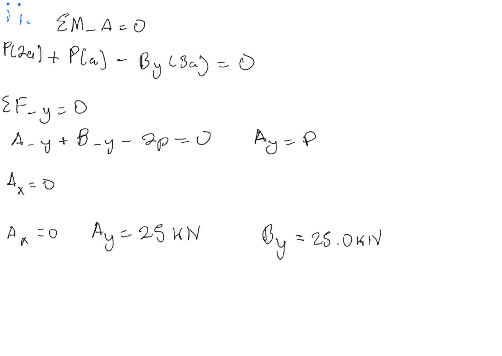


With P = 25 kN: A_x = 0, A_y = 25.0 kN up, B_y = 25.0 kN up.

Both `a` and `b` cancel. The reactions do not depend on the geometry at all — the two
loads sit symmetrically about the midline, so each support carries exactly half no matter
how the truss is shaped. That is a check I could have made before doing any algebra, and
I used it to confirm the moment equation was set up right.

### Method of joints

Sign convention throughout: positive means tension, so a positive member force pulls
the joint toward the far end of the member.

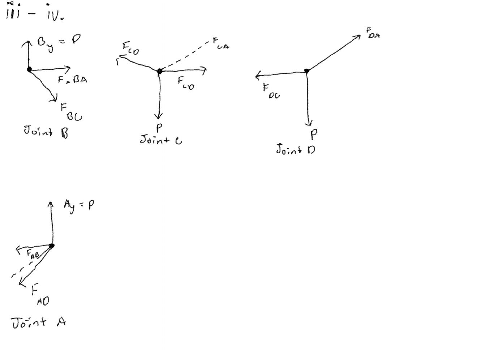

I started at joint B because it has only two unknown member forces. With
`L1 = sqrt(a² + b²) = 0.5 m`, the unit vector from B toward C is `(a, −b)/L1`:

The negative sign means the top chord is in compression, which matches intuition: the
diagonals hang the load below the supports and push them apart, and AB resists that.

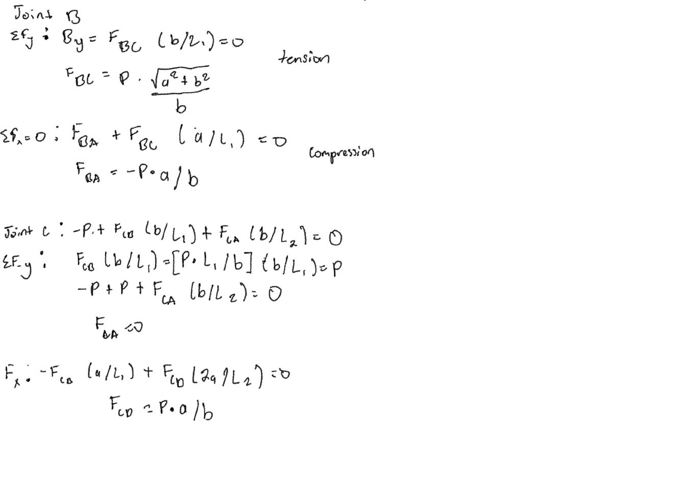

At joint C something happened I did not expect. Substituting the value of `F_CB` I had
just found into vertical equilibrium:

```
SUM F_y = 0:   −P + F_CB (b/L1) + F_CA (b/L2) = 0
               F_CB (b/L1) = [P L1/b](b/L1) = P
               −P + P + F_CA (b/L2) = 0
               F_CA = 0
```

Member AC carries no force at all. My first reaction was that I had made an algebra
mistake, because I had just spent a while deciding which diagonal to use and it turned out
not to matter. I checked it twice before accepting it. What it actually means is that AC
is a bracing member: under this symmetric load it carries nothing, but without it the
structure is a four-bar linkage and it collapses. It earns its weight by providing
rigidity rather than by carrying load, and it would pick up force immediately under any
unsymmetric case.

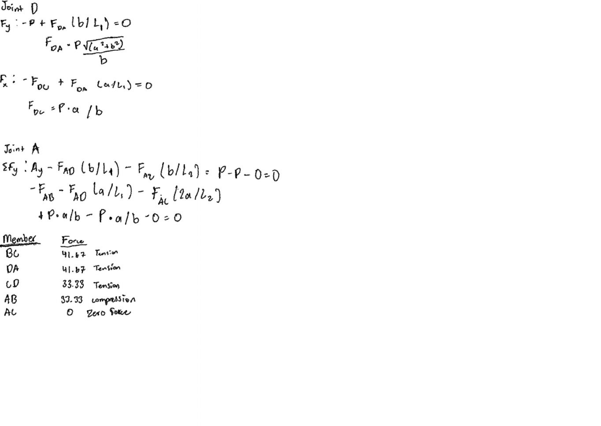

Joint A was my check. Every force there was already known, so both equations had to close
to zero — and they did, which told me the whole solution was consistent.

| Member | Symbolic | Force | State |
|---|---|---|---|
| BC | `P sqrt(a²+b²)/b` | 41.67 kN | Tension |
| DA | `P sqrt(a²+b²)/b` | 41.67 kN | Tension |
| CD | `P a / b` | 33.33 kN | Tension |
| AB | `− P a / b` | 33.33 kN | Compression |
| AC | `0` | 0 | Zero force |

Looking at the symbolic form `P sqrt(a²+b²)/b` told me something the numbers alone would
have hidden: that value is forced by the geometry, not by my choice of layout. Each
support has to deliver a vertical `P` through a single inclined member whose slope is
fixed at `b` to `a`, so no rearrangement of the five members lowers it. The only lever is
a deeper truss — raising `b` from 0.3 m to 0.4 m would drop the peak force about 12 % —
but `b` was fixed by the assignment.

### Sizing the members

All five members share one section, so the section is sized on the largest force and
everything else has margin automatically. A500 Gr. B: yield 290 MPa, density 7850 kg/m³.

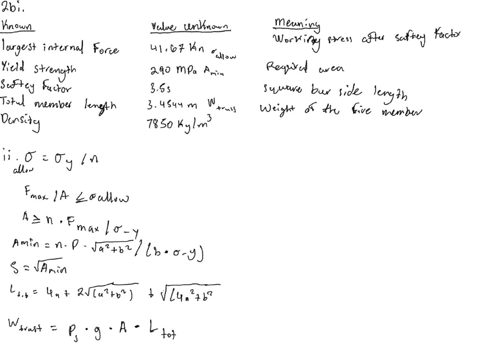

```
sigma_allow = sigma_y / n
F_max / A  ≤  sigma_allow
A_min = n · P · sqrt(a² + b²) / (b · sigma_y)

A_min = (3.5)(25000)(0.5) / [(0.3)(290e6)] = 502.9 mm²
s = sqrt(502.9) = 22.42 mm   →   specify 23 × 23 mm square bar
```

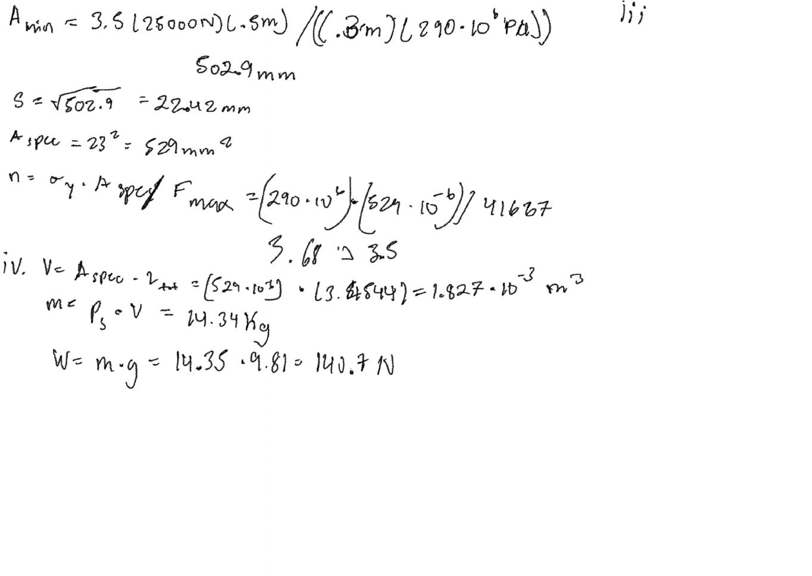

I rounded up to 23 mm rather than using 22.42 mm exactly, because a design number
should be something you could order, and rounding down would drop below the required
safety factor. Checking afterwards, the 23 mm bar gives an achieved factor of 3.68,
which confirms the rounding went the right way.

There is one thing about this result that bothers me and I want to state it rather than
hide it. Member AB carries 33.3 kN of compression over an unbraced length of 1.2 m. The
assignment says to assume compression members do not buckle, so sizing on yield is what
was asked and the 23 mm bar passes. But a 23 mm square bar at 1.2 m has a slenderness
ratio near 180, and the Euler critical load works out to roughly 20 kN — well below the
33 kN it actually carries. In a real design this member would buckle long before it
yielded. The design satisfies the assignment; it would not satisfy a real load case.

### Sizing the pins

Following the method in the course handout *Shear on a pin*, the load on a pin is not read
off a list of member forces — it is the resultant of the forces meeting at that joint,
which the handout calls `F_t`.

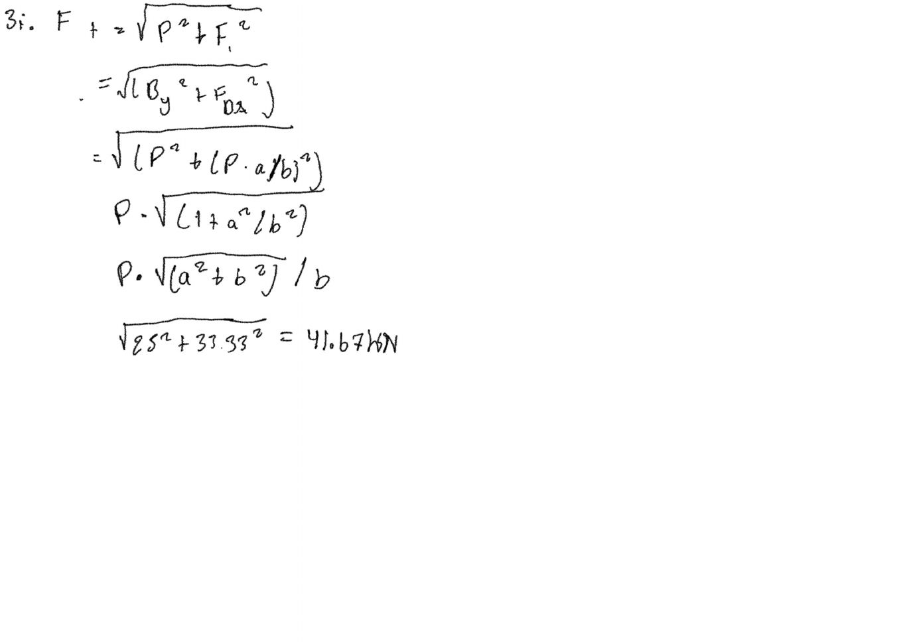

```
F_t = sqrt(P² + F_1²)

at joint B, with F_1 = F_BA = P a / b:
F_t = sqrt(P² + (P a/b)²) = P sqrt(a² + b²)/b
    = sqrt(25² + 33.33²) = 41.67 kN
```

Because the truss is symmetric, every joint returns the same resultant. There is no
single worst pin — all four are loaded identically, so one pin size serves the whole truss
with no wasted margin anywhere. `F_t` also comes out equal to the force in the inclined
member at that joint, which is not a coincidence: the joint is in equilibrium, so the
resultant of any two forces must balance the remaining ones. I used that as a check that
I had combined the vectors correctly.

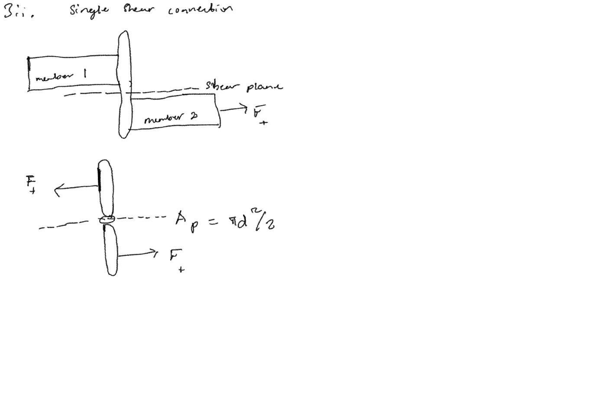

```
tau = F_t / A        tau_allow = S_y / SF
A = F_t (SF) / S_y

A_p = (41667)(4) / (1172e6) = 142.2 mm²
d   = sqrt(4 A_p / pi) = 13.46 mm   →   specify d = 14 mm
```

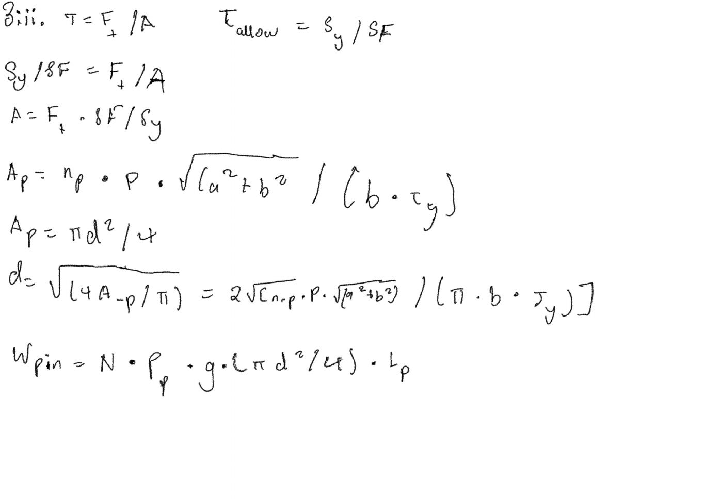

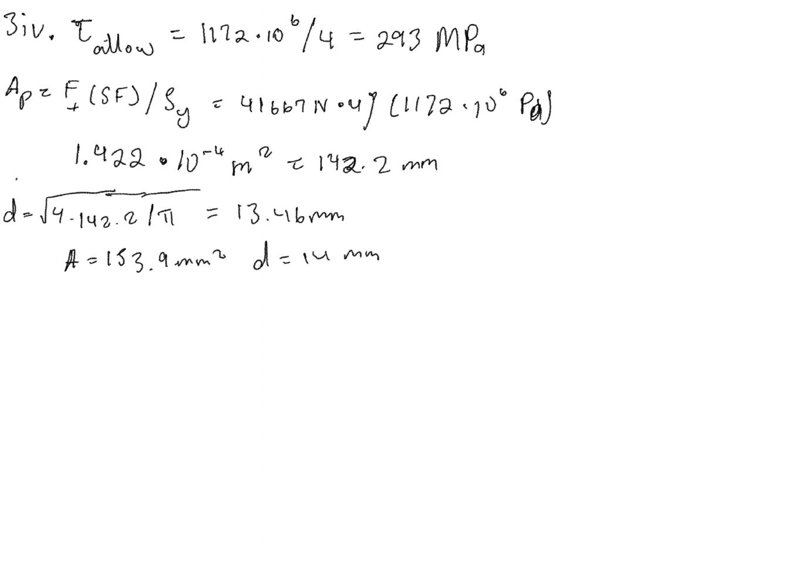

Achieved safety factor with the 14 mm pin: 4.33.

What stood out here is the difference in working stress. The pin runs at 293 MPa while the
member it connects runs at only 79 MPa, even though both carry the same 41.67 kN. The
member spreads that load over 529 mm² of square section; the pin concentrates it into a
single 154 mm² circle. Joints are far more stress-critical than the members they join.
Choosing a double shear connection would have split the load across two planes and dropped
the pin to about 9.5 mm.

### Weight

| Member | Symbolic length | Length |
|---|---|---|
| AB | `3a` | 1.2000 m |
| BC | `sqrt(a² + b²)` | 0.5000 m |
| CD | `a` | 0.4000 m |
| DA | `sqrt(a² + b²)` | 0.5000 m |
| AC | `sqrt(4a² + b²)` | 0.8544 m |
| Total | | 3.4544 m |

```
V = A_spec · L_tot = (529e-6)(3.4544) = 1.827e-3 m³
m = 7850 × 1.827e-3 = 14.34 kg
W = 140.7 N   (31.6 lbf)
```

My first pass at the pins assumed one length for all four joints, and that was wrong.
Three members meet at joints A and C but only two at B and D, so the stacks are 69 mm
and 46 mm respectively. Adding clearance for a head and a retainer gives 75 mm pins at A
and C and 50 mm pins at B and D. Assuming a uniform 50 mm pin understated the pin mass by
about 25 %.

| Joint | Members meeting there | Stack | Pin length |
|---|---|---|---|
| A | AB, DA, AC | 3 × 23 = 69 mm | 75 mm |
| C | BC, CD, AC | 3 × 23 = 69 mm | 75 mm |
| B | AB, BC | 2 × 23 = 46 mm | 50 mm |
| D | CD, DA | 2 × 23 = 46 mm | 50 mm |

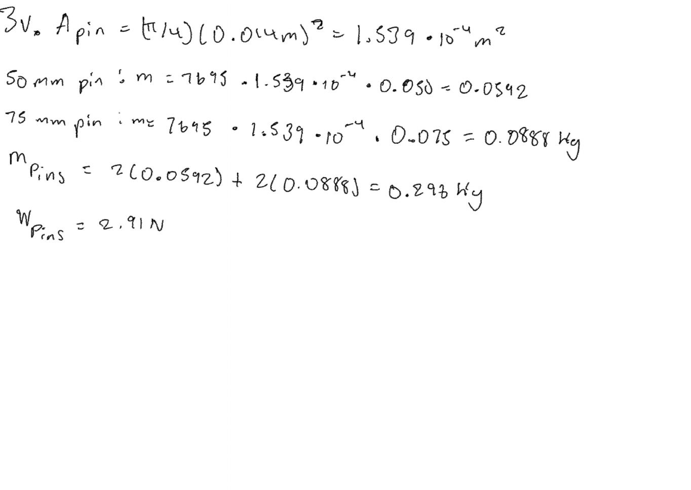

```
A_pin = (pi/4)(0.014)² = 1.539e-4 m²
50 mm pin: 7695 × 1.539e-4 × 0.050 = 0.0592 kg each
75 mm pin: 7695 × 1.539e-4 × 0.075 = 0.0888 kg each

m_pins = 2(0.0592) + 2(0.0888) = 0.296 kg     W_pins = 2.91 N
```

Total: 14.34 + 0.30 = 14.64 kg = 143.6 N (32.3 lbf).

The diameter is set by the shear load and is identical everywhere; only the length follows
the joint. Even corrected, the pins are 2.0 % of the assembly mass, so specifying an
expensive hardened tool steel at the joints costs almost nothing in weight.

### Building the model in SolidWorks

My first attempt was to sketch the geometry by hand, and that went badly in a way worth recording. When you draw a line, SolidWorks watches the cursor and quietly adds relations it thinks you want — horizontal, coincident, equal. It decided the top chord AB and the bottom chord CD should be *equal length*. They are 1200 mm and 400 mm. Every time I deleted that relation and added a dimension, another inferred relation appeared somewhere else and the sketch either over-defined or shifted.

So I built it with a VBA macro instead. The important line is `SketchManager.AddToDB = True`, which writes geometry straight into the model database with inference switched off. Nothing is snapped and nothing is guessed, so every coordinate lands exactly where the calculation puts it. The macro draws each member as its own 23 mm wide rectangle centred on its centreline, extrudes each one 23 mm and merges them, which gives a true 23 x 23 mm square section on all five members and a single solid body.

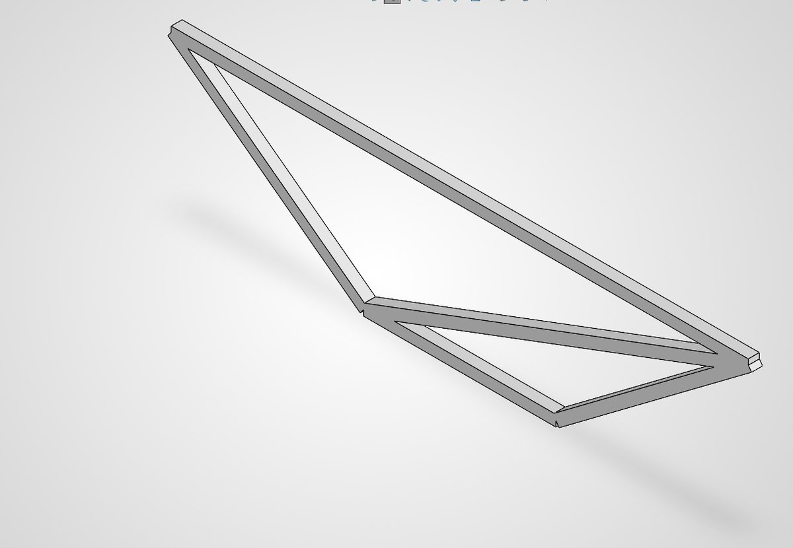

The macro also recomputes the sizing from `a`, `b` and `P` rather than using hard-coded numbers, and reports them when it finishes. It returned `F_max` = 41.67 kN, `A_min` = 502.9 mm^2 and `d` = 13.46 mm — an independent check on the hand calculations, the same three numbers arrived at twice by different routes.

Two bugs on the way, both worth recording because both failed silently. `GetUserPreferenceStringValue(9)` returns the *assembly* template rather than the part template, so the first run quietly built an assembly. And a mid-plane end condition made every extrusion fail with no error at all, leaving five sketches stacked up and no solid body — the only visible symptom was a reported volume of zero. Switching to a blind extrusion fixed it.

### The material

A500 is not in the SolidWorks material library, and neither is a tool steel at the density this assignment specifies. Both had to be built by hand: Edit Material, copy Plain Carbon Steel, create a custom library, paste, rename and edit the properties.

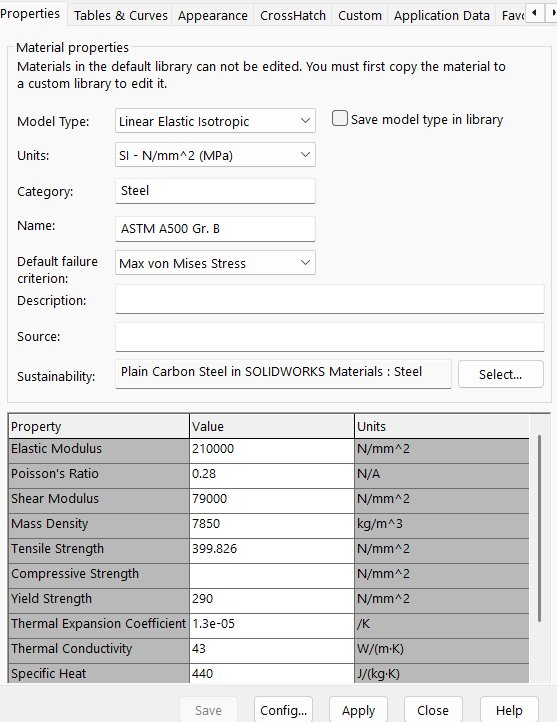

For the truss I set mass density to 7850 kg/m^3 and yield strength to 290 N/mm^2, the 2.9e8 Pa used in the sizing. For the pins I set density to 7695 kg/m^3, the 0.278 lb/in^3 given in the assignment. The built-in tool steels sit around 7800 kg/m^3 and would have skewed the weight comparison.

One honest gap: the assignment gives the pin material a yield *shear* strength of 170 ksi, and SolidWorks has no field for shear strength — only shear modulus, which is a different quantity. I left it out rather than putting the number in a box where it does not belong. It has no effect on mass properties, which is all the model is being used for.

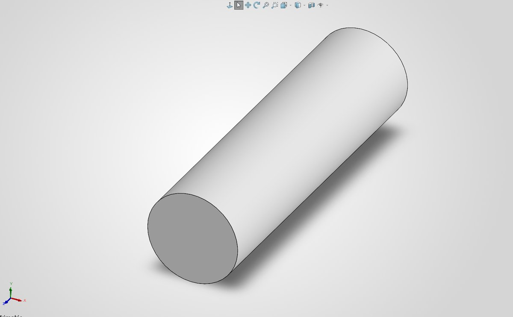

### Comparing the model against my calculations

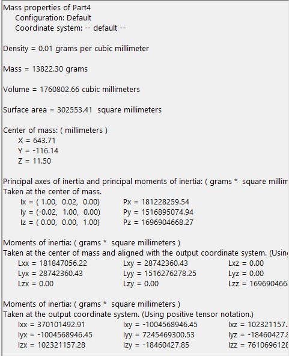

```
Part4 (truss)      Mass = 13822.30 g   Volume = 1760802.66 mm^3
Part5 (75 mm pin)  Mass =    88.84 g   Volume =   11545.35 mm^3
Part6 (50 mm pin)  Mass =    59.23 g   Volume =    7696.90 mm^3

truss           13822.30 g
2 x 75 mm pin     177.68 g
2 x 50 mm pin     118.46 g
                ----------
TOTAL           14118.44 g  =  14.118 kg  =  138.50 N
```

| Quantity | By hand | SolidWorks | Difference |
|---|---|---|---|
| Truss volume | 1 827 378 mm^3 | 1 760 803 mm^3 | -3.6 % |
| Truss mass | 14.34 kg | 13.82 kg | -3.6 % |
| Four pins | 0.296 kg | 0.296 kg | 0.0 % |
| Total mass | 14.64 kg | 14.118 kg | -3.6 % |
| Total weight | 143.6 N | 138.50 N | -3.6 % |

The model came in 3.6 % lighter than my hand calculation, and that gap is explained rather than worrying. My hand calculation multiplies the 529 mm^2 section by the full centreline length of all five members, which counts the material where two members overlap at a joint twice. SolidWorks merges the five extrusions into a single solid body, so that shared corner volume is counted once. Five joints worth of double counting comes to about 67 000 mm^3, which is the difference.

The pins match to three decimal places, and that is the check that the discrepancy really is joint overlap: the pins are separate cylinders that intersect nothing, so there is no shared volume for the hand calculation to double count, and the two methods agree exactly. A model that came out *heavier* than the hand calculation would have meant something was wrong — most likely the material density not applied, or a profile still at its default size.

---

## Decide

I selected the layout AB – BC – CD – DA – AC: the four-sided frame plus one long
diagonal, with the diagonal running from A to C.

Three things drove that choice.

Five members, not four. The obvious frame — AB across the top, BC down, CD across the
bottom, DA back up — is four members and four joints. That is a four-bar linkage, not a
truss; it has one degree of freedom left in it and folds flat under load. The determinacy
equation says five, and the fifth member is the actual design decision in this part of the
assignment rather than a detail.

Which member to add was decided by buildability, not by force. Of the six possible
connections, most five-member combinations put two members crossing each other in mid-air,
which cannot be fabricated. Only the two layouts that drop a long diagonal are buildable,
and they are mirror images with identical member forces. So the choice between them is
free, and I took AC.

The geometry, not the layout, sets the design. The governing force is
`P sqrt(a²+b²)/b` = 41.67 kN regardless of which valid layout I pick, because each support
must pass a vertical `P` through one member inclined at `b` to `a`. That means there was no
lighter arrangement available to find, and the honest thing to say is that the weight of
this truss was determined by the constraints I was handed rather than by cleverness in the
layout. The one real lever — a deeper truss — was fixed at `b` = 0.3 m.

---

## Communicate

### Results

| Quantity | Symbolic | Value |
|---|---|---|
| Support reactions | `B_y = A_y = P`, `A_x = 0` | 25.0 kN each |
| Largest member force | `P sqrt(a²+b²)/b` | 41.67 kN, tension, BC and DA |
| Required member area | `n P sqrt(a²+b²)/(b σ_y)` | 502.9 mm² → 23 × 23 mm |
| Achieved member SF | | 3.68 |
| Pin shear load | `F_t = sqrt(P² + F_1²)` | 41.67 kN |
| Required pin area | `F_t (SF)/S_y` | 142.2 mm² → 14 mm dia |
| Achieved pin SF | | 4.33 |
| Truss weight | | 14.34 kg, 140.7 N |
| Pin weight | | 0.296 kg, 2.91 N |
| Total (hand) | | 14.64 kg, 143.6 N |
| Total (SolidWorks) | | 14.118 kg, 138.50 N |
| Difference | | -3.6 %, joint overlap |

### Lessons learned

There is never enough checking. This is the one that actually changed how I work.
Almost everything that went wrong on this assignment was silent — nothing threw an error,
nothing turned red, the work just quietly stopped being correct, and the only reason I
caught any of it was that I checked something I had no particular reason to doubt.

I nearly submitted a truss made of four members, which is a linkage that folds flat,
because I sketched it before I checked `m + r = 2j` — an equation I had already written
down. I assumed all four pins were the same length until I drew the joints out and found
three members meeting at A and C, which had me understating the pin mass by about a
quarter. Neither of those announced itself.

What I take from that is that a check is worth most when you expect it to pass. The
joint A closure check was the clearest example: every force there was already known, so
both equations had to come out zero, and they did — which is exactly what made the rest of
the joint solution trustworthy. Two independent routes to the same number is worth more
than one route done carefully.


Next time I do something like this, I will be doing all the checks I need beforehand rather than getting 
to the point where the mistake is evident. Verifying the things before sketching and never accepting a 
number that wasn't predictable

A zero-force member is not a useless member. AC carries nothing under this load, and I
nearly concluded I had made an error. It exists to make the structure rigid, and it would
carry load immediately under any unsymmetric case. Zero force in one load case is not the
same as unnecessary.

An assumption you are handed is still an assumption worth checking. Sizing on yield
alone gives a member that passes the stated safety factor but would buckle at around 20 kN
against the 33 kN it carries. The assignment told me to ignore buckling, and I did, but
knowing what that assumption cost me is different from not knowing it was there.

### Time


This assignment in its entirety took me about 9 hrs finish. This entire assignment took a 
while to create; overall a long assignment. What took the most time was rebuilding the pin weight 
after the lengths were not the same and also documentation. Getting every little thing down 
while showing all the figures and calculations. Also, make sure the calculations are readable.
