# A3 – Parametric Design and FEA

## Objective

Design a cantilever hollow box beam. The beam carries a uniformly distributed load
somewhere between 25 and 250 lb/ft, it can deflect no more than 0.1 in at the free
end, and it has to be aluminum 7075. The model has to be parametric, so that changing
the load or the wall thickness updates the geometry instead of forcing a redesign.
Then run an FEA on it and see how close the software lands to the hand calculation.

## Analyze

### Picking the load and the cross-section

The load is mine to choose inside the 25–250 lb/ft window. I picked 150 lb/ft, which
sits in the upper half of the range so the beam is actually working, not just floating
in the middle of the window. Converted to the units I did the rest of the work in:

For the cross-section I did not make it square. A cantilever under a distributed load
is in bending, and bending stiffness goes with the cube of the depth, so depth buys far
more than width does. I made the beam taller than it is wide:

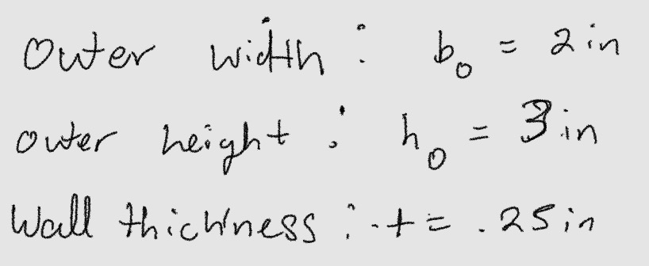

The inner opening follows from the wall thickness rather than being its own input,
which is the first piece of the parametric scheme:

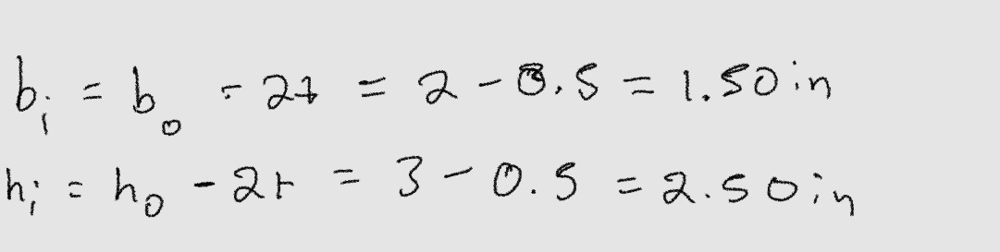

### Second moment of area

For a hollow rectangle it is the outer box minus the inner box, both about the same axis:

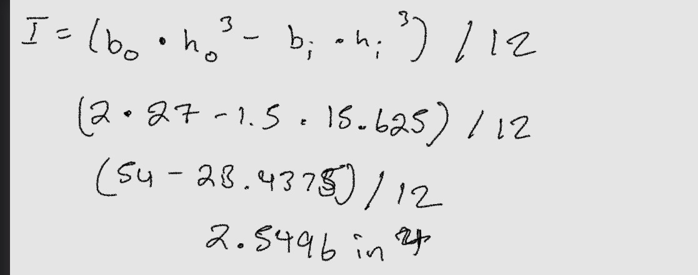

Cross-sectional area, which I need later for weight:

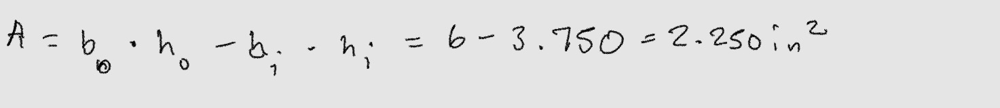

Section modulus:

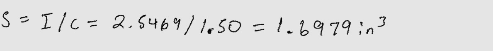

### Solving for the length

The deflection limit is what sets the length. For a cantilever carrying a uniform load
over its whole span, the free-end deflection is

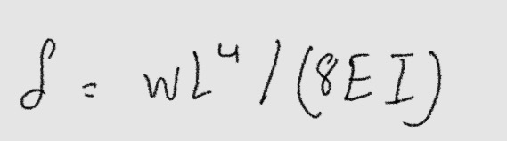

Everything in that except L is known, so rearranging for L:

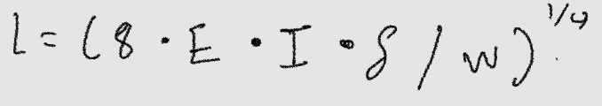

Aluminum 7075-T6 has a modulus of elasticity of 71.7 GPa, which is 10.4 × 10⁶ psi.
Putting the numbers in:

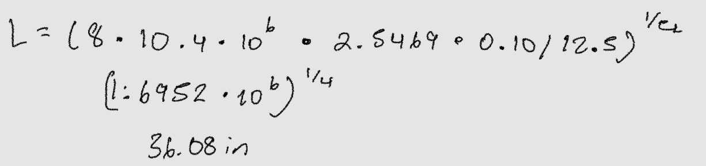

So 36.08 in is the longest this beam can be before it deflects past 0.1 in.

### The self-weight check

36.08 in is the answer if the only thing loading the beam is the 150 lb/ft. The beam
also has to hold itself up. Aluminum 7075 has a density of 0.1015 lb/in³, so the beam
adds its own distributed load:

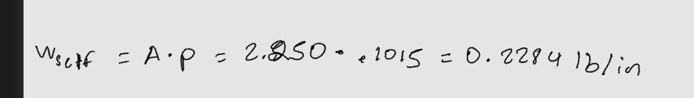

That is only 1.8 % of the applied load, which is small enough that it is easy to skip.
I checked it anyway, and it matters:

At L = 36.0 in the deflection with self-weight included is 0.1009 in. That is over the
limit. Not by much, but the requirement is 0.1 in and 0.1009 is not 0.1.

Redoing the length solve with the total load:

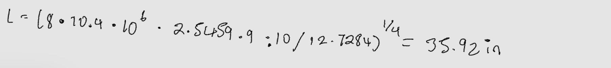

I rounded down to L = 35.5 in. Rounding down is the safe direction here, since a shorter
cantilever deflects less. At 35.5 in:

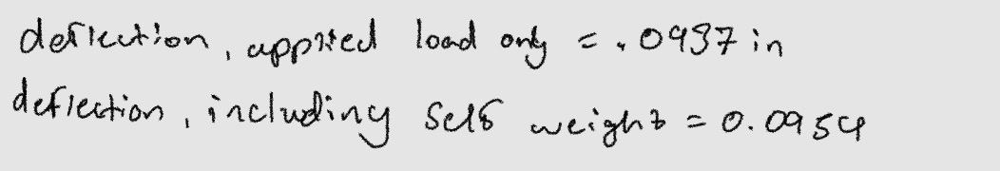

### Stress check

Deflection set the length, but I still have to confirm the beam does not yield. Maximum
bending moment on a cantilever with a uniform load is at the fixed end:

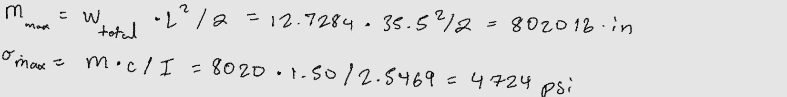

Aluminum 7075-T6 yields at about 73,000 psi, so:

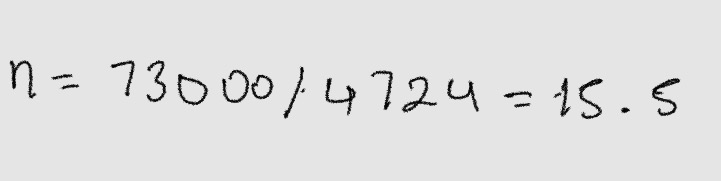

A safety factor of 15 is enormous. That is not an accident or a mistake — it is the
whole point of this problem. The beam is stiffness-limited, not strength-limited. The
0.1 in deflection requirement runs out of room long before the aluminum gets anywhere
near yielding. If I had sized this beam on stress alone I would have ended up with
something far too flexible to be useful.

I also checked transverse shear, since a thin-walled section can fail there before it
fails in bending. Maximum shear is also at the fixed end:

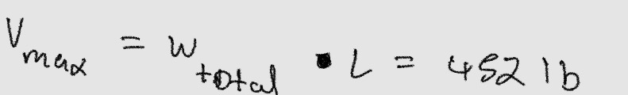

Carried almost entirely by the two vertical webs:

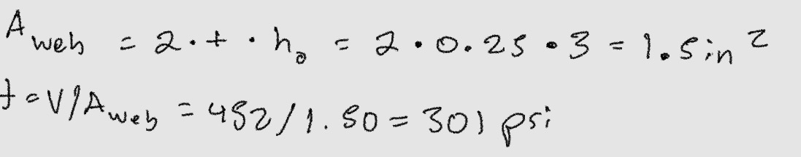

Negligible compared to bending. Not a concern.

### Weight

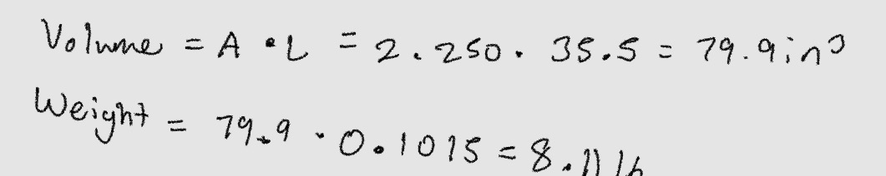

## The parametric scheme

This is the part that makes the model parametric instead of just a box of the right
size. In SolidWorks I set up global variables for the things I chose, and equations for
everything that follows from them.

Driving variables (the ones I decide):

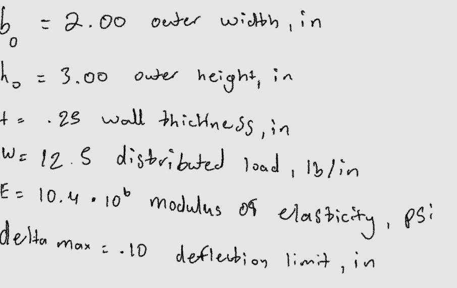

Driven equations (the ones SolidWorks works out):

    "b_i"     = "b_o" - 2 * "t"
    "h_i"     = "h_o" - 2 * "t"
    "A"       = "b_o" * "h_o" - "b_i" * "h_i"
    "I"       = ( "b_o" * "h_o" ^ 3 - "b_i" * "h_i" ^ 3 ) / 12
    "w_total" = "w" + "A" * "rho"
    "L_calc"  = ( 8 * "E" * "I" * "delta_max" / "w_total" ) ^ ( 1 / 4 )
    "L"       = int ( "L_calc" * 2 ) / 2

Geometry driven by those variables:

    "D1@Sketch1"       = "b_o"
    "D2@Sketch1"       = "h_o"
    "D3@Sketch1"       = "b_i"
    "D4@Sketch1"       = "h_i"
    "D1@Boss-Extrude1" = "L"

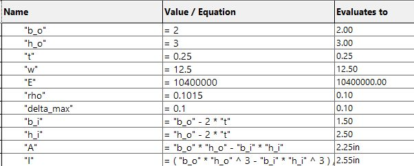

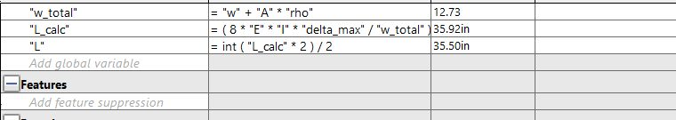

The values SolidWorks evaluated match the hand calculation line for line: b_i = 1.50,
h_i = 2.50, A = 2.25, I = 2.55, w_total = 12.73, L_calc = 35.92, L = 35.50.

Two things I want to point out about this scheme.

The self-weight is inside the equations, not bolted on afterwards. "A" feeds "w_total",
which feeds the length solve. So if I thicken the wall, the beam gets heavier and the
software accounts for that heavier beam when it re-solves the length.

The rounding is also parametric. "L" = int("L_calc" * 2) / 2 rounds the solved length
down to the nearest half inch. Rounding down is the safe direction, and doing it in an
equation means I never have to remember to redo it by hand. 35.92 becomes 35.50 on its
own.

In the sketch, all four dimensions show a red sigma next to them, which is how
SolidWorks marks a dimension that is driven by an equation rather than typed in.

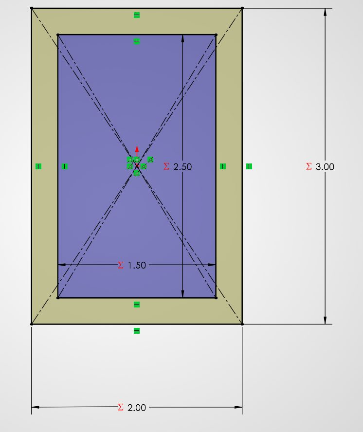

One thing to watch: SolidWorks equations do not track units, they just do arithmetic on
numbers. The document has to be in IPS so that a bare number like 2 is read as 2 inches.
I set that before building anything. Mixing in a millimetre anywhere would silently
produce garbage.

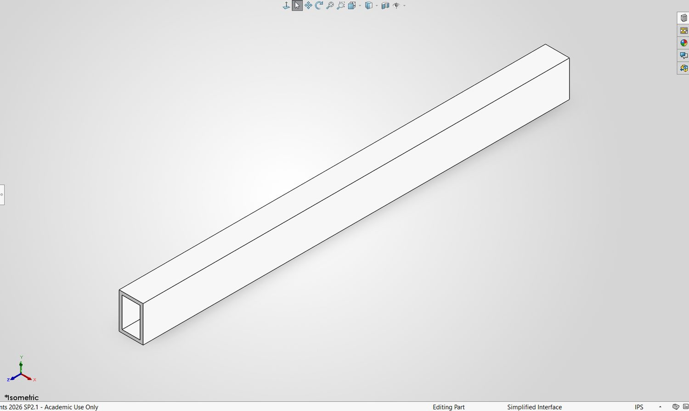

## The material

I used the SolidWorks library 7075-T6 (SN) rather than building a custom material,
because the library values turned out to be almost exactly what I had used by hand:

| Property | My hand calculation | SolidWorks 7075-T6 | Difference |
|---|---|---|---|
| Elastic modulus | 10.40 x 10^6 psi | 72,000 MPa = 10.44 x 10^6 psi | +0.4 % |
| Yield strength | 73,000 psi | 505 MPa = 73,244 psi | +0.3 % |
| Density | 0.1015 lb/in^3 | 2810 kg/m^3 = 0.1015 lb/in^3 | exact |

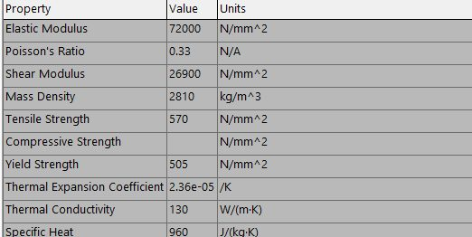

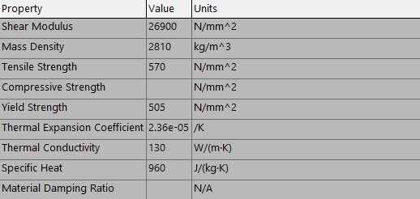

That 0.4 % on E matters later, because deflection is inversely proportional to it. A
stiffer modulus in the software means the software should predict slightly *less*
deflection than my hand number, not more. It predicted more, and the reason why is the
interesting part of this assignment.

## FEA setup

1. Fixed Geometry restraint on the end face of the tube. Not the whole end of the solid
   and not an edge, the actual annular face, which is what a real bolted plate would grab.
2. Force of 443.75 lbf normal to the top face, pointing down. That is w x L = 12.5 x 35.5,
   the whole distributed load applied over the top surface, which spreads it uniformly
   along the length exactly like the w in the hand calculation.
3. Gravity on, 9.81 m/s^2 downward, so the beam's own 8.11 lb is included. My hand
   calculation includes self-weight, so the simulation has to as well or the comparison
   is not honest.
4. Standard mesh, solved as a linear static study.

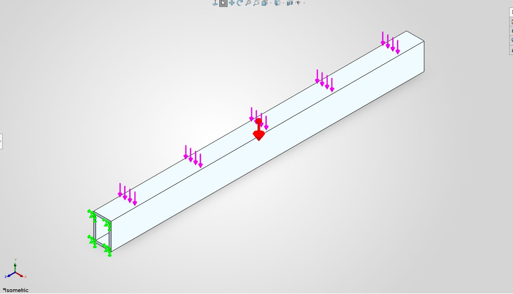

## Results from the FEA

    maximum resultant displacement (URES)  = 0.09622 in
    maximum von Mises stress               = 5,243 psi
    yield strength of 7075-T6              = 73,244 psi
    factor of safety                       = 73,244 / 5,243 = 14.0

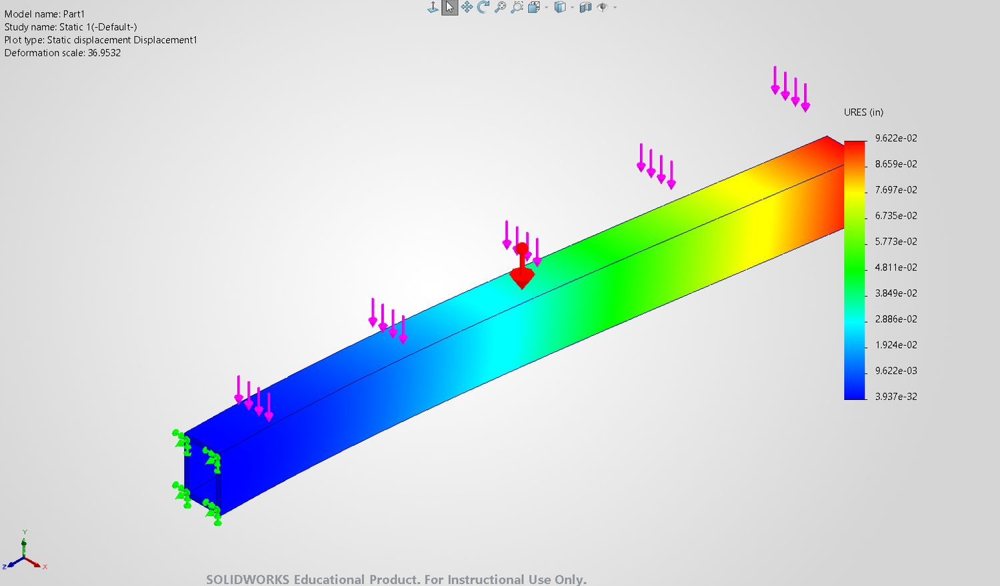

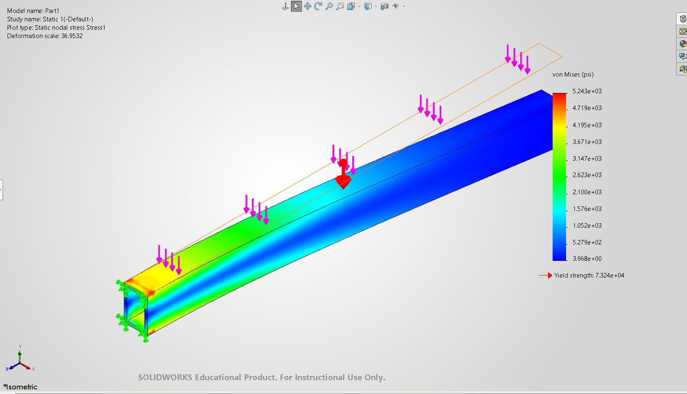

## Decide

The final design is a 2.00 x 3.00 in hollow box with 0.25 in walls, 35.5 in long, in
aluminium 7075-T6, weighing 8.11 lb and carrying 150 lb/ft.

The decision that shaped everything was making the section rectangular rather than square.
Depth enters the stiffness as a cube, so at the same cross-sectional area a beam that is
taller than it is wide is dramatically stiffer in the direction that matters. A square
section of the same area and wall thickness would have forced a shorter beam to meet the
same deflection limit.

The other real decision was to include self-weight. It only changed the length by about
half an inch, but the version that ignored it came out at 0.1009 in, and "over the limit"
is a fail no matter how small the margin.

## Communicate

### Results

| Quantity | Value | Where it came from |
|---|---|---|
| Distributed load | 150 lb/ft (12.5 lb/in) | Chosen, inside the 25-250 lb/ft range |
| Section, outer | 2.00 x 3.00 in | Chosen |
| Wall thickness | 0.25 in | Chosen |
| Section, inner | 1.50 x 2.50 in | Driven by wall thickness |
| Second moment of area | 2.5469 in^4 | Hollow box formula |
| Length | 35.5 in | Solved from the deflection limit, rounded down |
| Weight | 8.11 lb | 79.9 in^3 x 0.1015 lb/in^3 |

### Hand calculation against FEA

| Quantity | Hand calculation | FEA | Difference |
|---|---|---|---|
| Free-end deflection | 0.0954 in | 0.0962 in | +0.9 % |
| Maximum von Mises stress | 4,724 psi | 5,243 psi | +11 % |
| Factor of safety vs yield | 15.5 | 14.0 | - |

### Compare and contrast

The deflection agreed to within 1 %. That is about as close as beam theory and a solid
mesh ever get, and it is the result I care about most, because deflection is what sized
this beam.

The small gap that is there runs the opposite way to what the material properties alone
would predict. SolidWorks uses a slightly stiffer modulus than I did, 10.44 x 10^6 psi
against my 10.40 x 10^6, so on that basis it should have come out about 0.0950 in,
slightly *under* my number. It came out at 0.0962 in instead, about 1.3 % over. The
reason is that the deflection formula I used only accounts for bending. A solid mesh also
lets the material shear, and shear adds deflection that beam theory throws away. On a
short, deep beam like this one, where the length is only about twelve times the depth,
that contribution is small but not zero, and 1.3 % is exactly the size of effect you
would expect.

The stress comparison is the one that needs reading carefully. The FEA reports a peak of
5,243 psi against my 4,724 psi, 11 % higher. Almost all of that is an artefact of the
restraint. A Fixed Geometry face is perfectly rigid, and nothing in the real world is, so
the mesh piles up stress in the elements right against it. On the plot that shows as the
yellow and orange patch sitting on the fixed end and nowhere else. Read the plot an inch
or two back from the wall and the colours drop into the 4,000 to 4,700 psi band, which
brackets my hand number. If I were designing a real bracket I would not size the part off
that 5,243 psi peak, I would either model the actual bolted joint or read the stress away
from the constraint.

Either way it does not change the outcome. The beam is fifteen times stronger than it
needs to be. Deflection is what governs this design, and both methods agree on it.

### Lessons learned

A design can be governed by something other than the thing you instinctively check. I
reached for stress first, because that is what the last two assignments trained me to do,
and stress turned out to be nearly irrelevant here. The beam is fourteen times stronger
than it needs to be and still only just passes on deflection. Stiffness and strength are
separate problems and a part can pass one and fail the other.

The second thing is that parametric modelling is worth the setup time only if you push
the parameters all the way through. It would have been quicker to work out the length on
paper and type 35.5 into the extrude. Building the whole chain, including the self-weight
term and the rounding, meant the model could re-solve itself, and it also meant the
software independently reproduced every intermediate number I had calculated by hand.
That is a free check on my own arithmetic, and it caught nothing this time, which is the
best possible outcome.

### Time spent

This assignment took me about 6 hours, with breaks.
