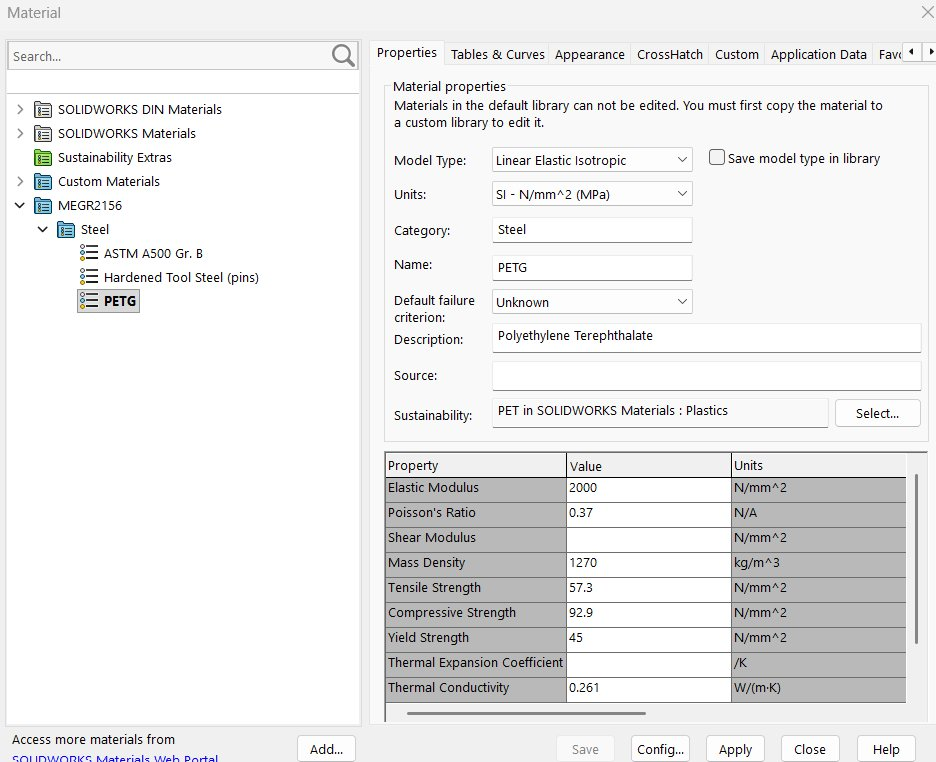
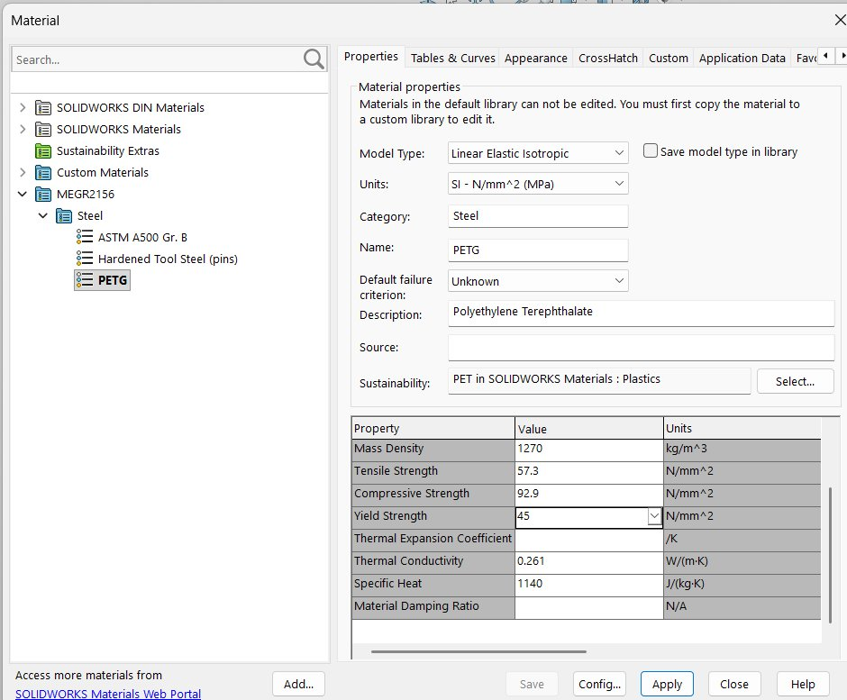
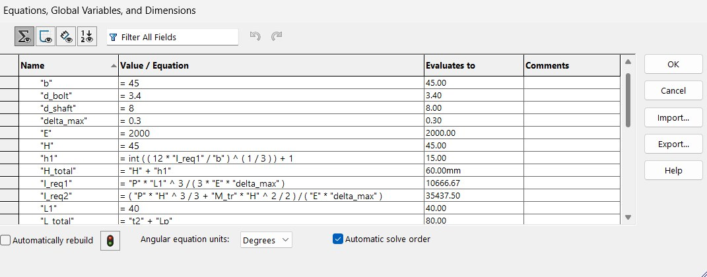
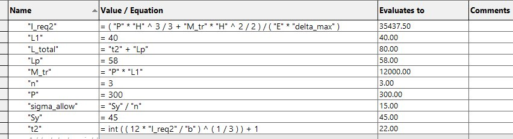
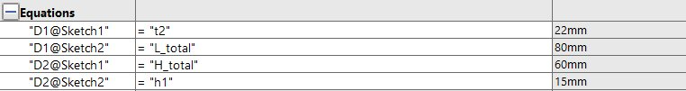
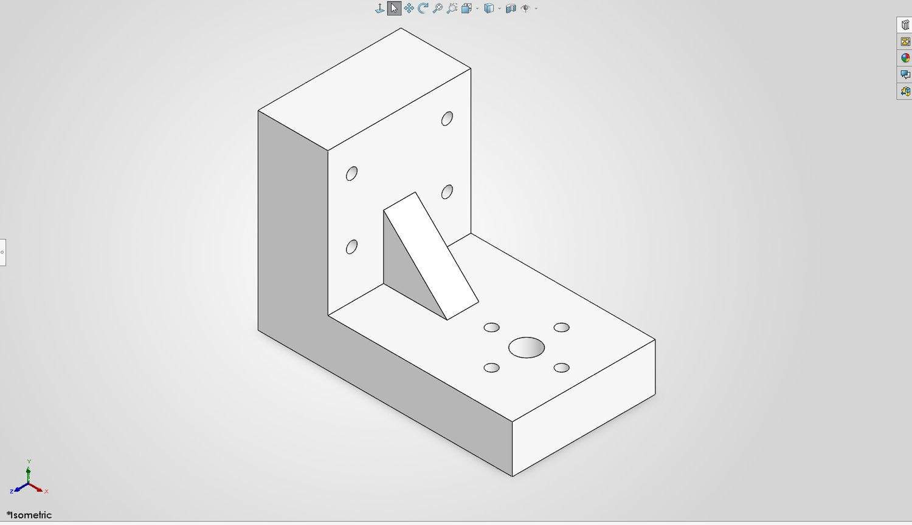

# A4 – Motor Mount

## Objective

Design a mount for a brushed 24 V DC gear motor with a 99.5:1 planetary gearbox, bolted
to rigid wall A. The mount is made of two features: Feature 1 carries the motor, Feature 2
bolts to the wall. Both are sized first for yield strength and then for a maximum
deflection of 0.30 mm at the free end, with a safety factor of 3 on a 300 N shaft load.
The motor's own weight is neglected. The finished design is modelled parametrically in
SOLIDWORKS with clearance holes for the shaft and the bolts.

## Design requirements

| Requirement | Value | Where it came from |
|---|---|---|
| Applied load, P | 300 N | Assignment, Figure 1 |
| Safety factor, n | 3 | Assignment |
| Maximum deflection | 0.30 mm | Assignment |
| Motor shaft | Ø6 mm, 18 mm long | Appendix A |
| Motor mounting holes | 4 × M3 on a Ø22 mm bolt circle | Appendix A |
| Motor body | Ø28 mm | Appendix A |
| Bolt clearance holes | Ø3.4 mm | Assignment |
| Material | ABS, PETG or PLA | Assignment |

## Material selection

I chose PETG. All three allowed materials are printable thermoplastics, but PETG is
tougher than PLA and less prone to warping than ABS, which matters for a bracket that
carries a real load and has thin sections around the bolt holes.

Published PETG properties vary with print settings, so I used conservative lower-bound
values rather than the best numbers I could find:

    E  = 2000 MPa
    Sy = 45 MPa
    rho = 1270 kg/m^3

With the required safety factor of 3, the allowable stress is

    sigma_allow = Sy / n = 45 / 3 = 15 MPa

These are the values I entered into the custom PETG material in SOLIDWORKS, so the model
and the hand calculations use the same numbers.

## Feature 1 – motor plate

### Known and unknown variables

Known:

    P = 300 N
    n = 3
    delta_max = 0.30 mm
    E = 2000 MPa
    Sy = 45 MPa
    sigma_allow = 15 MPa
    b = 45 mm        plate width (chosen)
    L1 = 40 mm       distance from the corner to the motor centre (chosen)

Unknown:

    h        plate thickness
    I        area moment of inertia
    sigma    maximum bending stress
    delta    free end deflection

Why 45 mm wide: the motor body is Ø28 mm and the bolt circle is Ø22 mm, so the plate has
to be at least ~36 mm across to leave material outside the bolt holes. 45 mm gives about
8 mm of material past the motor body on each side.

Why 40 mm long: the motor has to sit clear of the wall plate. 40 mm puts the motor centre
far enough out that the Ø28 mm body does not foul the vertical plate, without making the
cantilever any longer than it needs to be — and every extra millimetre of length costs
deflection as the cube.

### Assumptions

Feature 1 is treated as a rectangular cantilever beam, fixed where it meets Feature 2,
with zero deflection and zero slope at that end, exactly as the assignment directs. The
300 N motor load is modelled as a point load at the motor centre. The motor's weight is
neglected. The safety factor of 3 is taken to cover the material removed by the shaft
opening and the bolt holes, so the beam is analysed as a solid rectangular section.

### Free-body diagram

Summing forces vertically gives the reaction at the fixed end equal to the applied load.
Taking moments about the fixed end gives the maximum bending moment, which occurs there:

    R = P = 300 N
    M_max = P * L1 = 300 * 40 = 12,000 N·mm

### Stress analysis, solved symbolically

For a rectangular section of width b and thickness h:

    I = b*h^3 / 12          c = h/2

    sigma_max = M*c / I = (P*L1)*(h/2) / (b*h^3/12) = 6*P*L1 / (b*h^2)

Setting sigma_max equal to the allowable stress and solving for h:

    h_stress = sqrt( 6*P*L1 / (b*sigma_allow) )

### Deflection analysis, solved symbolically

For a cantilever with a point load at the free end:

    delta = P*L1^3 / (3*E*I)

Solving for the required second moment of area:

    I_req = P*L1^3 / (3*E*delta_max)

and for a rectangular section:

    h_defl = ( 12*I_req / b )^(1/3)

### Numerical solution

    h_stress = sqrt( 6*300*40 / (45*15) ) = sqrt(106.67) = 10.33 mm

    I_req = 300*40^3 / (3*2000*0.30) = 10,666.7 mm^4
    h_defl = ( 12*10,666.7 / 45 )^(1/3) = 14.17 mm

Deflection governs, not stress. Rounding up to a practical dimension:

    h = 15 mm

### Checks on the selected section

    I = 45*15^3/12 = 12,656.3 mm^4   >=  10,666.7 mm^4        PASS
    sigma = 12,000*7.5/12,656.3 = 7.11 MPa   <=  15 MPa        PASS
    delta = 300*40^3/(3*2000*12,656.3) = 0.2528 mm  <= 0.30 mm PASS
    actual factor of safety = 45 / 7.11 = 6.3

## Feature 2 – wall plate

### Known and unknown variables

Known:

    P = 300 N                 load handed over from Feature 1
    M_tr = P*L1 = 12,000 N·mm moment handed over from Feature 1
    H = 45 mm                 wall plate cantilever height (chosen)
    b = 45 mm                 wall plate width, same as Feature 1
    E = 2000 MPa, Sy = 45 MPa, n = 3, delta_max = 0.30 mm

Unknown:

    t        wall plate thickness
    I, sigma, tau, delta

### Assumptions

Feature 2 is approximated as a rectangular cantilever fixed at the wall. The wall itself
is rigid and the bolts hold the plate against it without slipping, so the plate can be
treated as built in. The connection between the two features transfers both the 300 N
force and the bending moment that force creates about the corner — that transferred
moment is the load case that actually sizes this plate.

### Free-body diagram

### Stress analysis, solved symbolically

Both the force and the transferred moment bend the wall plate, and the worst section is
at the wall:

    M_max = P*H + M_tr

    sigma_max = 6*M_max / (b*t^2)      ->    t_stress = sqrt( 6*M_max / (b*sigma_allow) )

### Shear analysis

A thin plate can fail in transverse shear before it fails in bending, so this is checked
as well. For a rectangular section:

    tau_max = 3*V / (2*b*t)      with V = P

The allowable shear stress is estimated from the von Mises criterion:

    tau_allow = sigma_allow / sqrt(3)

### Deflection analysis, solved symbolically

The two loads are superposed — a point force at the free end plus an applied end moment:

    delta = P*H^3/(3*E*I) + M_tr*H^2/(2*E*I)

Solving for the required second moment of area:

    I_req = ( P*H^3/3 + M_tr*H^2/2 ) / (E*delta_max)
    t_defl = ( 12*I_req / b )^(1/3)

### Numerical solution

    M_max = 300*45 + 12,000 = 13,500 + 12,000 = 25,500 N·mm

    t_stress = sqrt( 6*25,500 / (45*15) ) = sqrt(226.67) = 15.06 mm

    I_req = ( 300*45^3/3 + 12,000*45^2/2 ) / (2000*0.30) = 35,437.5 mm^4
    t_defl = ( 12*35,437.5 / 45 )^(1/3) = 21.14 mm

Deflection governs again. Rounding up:

    t = 22 mm

### Checks on the selected section

    I = 45*22^3/12 = 39,930 mm^4   >=  35,437.5 mm^4            PASS
    sigma = 25,500*11/39,930 = 7.02 MPa   <=  15 MPa            PASS
    tau = 3*300/(2*45*22) = 0.455 MPa  <=  8.66 MPa             PASS
    delta = 0.2662 mm   <=  0.30 mm                             PASS
    actual factor of safety = 45 / 7.02 = 6.4

Note how small the shear stress is — 0.455 MPa against 8.66 MPa allowable. Shear was never
going to size this plate, but checking it is what tells you that bending is the real
problem rather than assuming it.

## Sketch

## CAD Model (Parametric)

### Global variables and equations

The whole model is driven from the design inputs rather than from typed dimensions.

Driving variables:

    "P" = 300            applied load, N
    "n" = 3              safety factor
    "E" = 2000           PETG modulus, MPa
    "Sy" = 45            PETG yield, MPa
    "delta_max" = 0.3    deflection limit, mm
    "b" = 45             bracket width, mm
    "L1" = 40            motor centre from the corner, mm
    "Lp" = 58            motor plate length past the corner, mm
    "H" = 45             wall plate height, mm
    "d_bolt" = 3.4       bolt clearance, mm
    "d_shaft" = 8        shaft clearance, mm

Driven equations:

    "sigma_allow" = "Sy" / "n"
    "I_req1" = "P" * "L1"^3 / ( 3 * "E" * "delta_max" )
    "h1"     = int( ( 12 * "I_req1" / "b" )^(1/3) ) + 1
    "M_tr"   = "P" * "L1"
    "I_req2" = ( "P" * "H"^3 / 3 + "M_tr" * "H"^2 / 2 ) / ( "E" * "delta_max" )
    "t2"     = int( ( 12 * "I_req2" / "b" )^(1/3) ) + 1
    "L_total" = "t2" + "Lp"
    "H_total" = "H" + "h1"

Geometry driven by those variables:

    "D1@Sketch1" = "t2"        ->  22 mm
    "D2@Sketch1" = "H_total"   ->  60 mm
    "D1@Sketch2" = "L_total"   ->  80 mm
    "D2@Sketch2" = "h1"        ->  15 mm

The two plate thicknesses are never typed in. `h1` and `t2` are solved from the deflection
requirement and then rounded up to the next whole millimetre by `int(...) + 1`, which is
the same rounding I did by hand. Change the load to 400 N, or the span to 50 mm, and the
bracket re-sizes itself.

One thing to watch: SOLIDWORKS equations do not carry units, they just do arithmetic on
numbers. The document has to be in MMGS so a bare 22 is read as 22 mm. I set that before
building anything.

### Features on the model

| Feature | Size | Why |
|---|---|---|
| Motor plate | 80 × 45 × 15 mm | Feature 1 analysis, 58 mm of reach past the corner |
| Wall plate | 22 × 45 × 60 mm | Feature 2 analysis |
| Shaft clearance | Ø8 mm | Ø6 mm shaft plus clearance |
| Motor bolt holes | 4 × Ø3.4 mm on a Ø22 mm bolt circle | M3 clearance, matches Appendix A |
| Wall bolt holes | 4 × Ø3.4 mm, 30 mm apart | M3 clearance into wall A |
| Corner rib | 20 × 20 × 10 mm triangle | Deflection-minimising feature |

### Feature to minimise deflection

The triangular rib at the inside corner is the deflection-minimising feature. Both plates
pass the 0.30 mm limit on their own, but the beam model treats the corner as perfectly
built in, and a real L-bracket does not behave that way — the corner opens up under load
and adds deflection the hand calculation never sees. The rib carries load straight across
that corner in compression instead of relying on the bend, which is the cheapest stiffness
available. It cost about 2,000 mm³ of material.

## Mistakes and changes

The first extrusion silently produced nothing. I had set the end condition to mid-plane,
which the model rebuilt without complaint but with zero volume, so the feature tree showed
sketches and no solid. Switching to a two-directional blind extrusion of 22.5 mm each way
gave the same symmetric result and actually built. The clue was the mass properties
reporting zero, not anything visible on screen.

I also pasted the PETG material into the existing MEGR2156 library and then renamed the
category to "Plastics", which moved the two steels from A2 into a category called Plastics
as well. I put that back.

## Results

| Quantity | Feature 1 | Feature 2 | Limit |
|---|---|---|---|
| Span | 40 mm | 45 mm | — |
| Section | 45 × 15 mm | 45 × 22 mm | — |
| Required I | 10,666.7 mm⁴ | 35,437.5 mm⁴ | — |
| Actual I | 12,656.3 mm⁴ | 39,930 mm⁴ | — |
| Max bending stress | 7.11 MPa | 7.02 MPa | 15 MPa |
| Max shear stress | — | 0.455 MPa | 8.66 MPa |
| Deflection | 0.2528 mm | 0.2662 mm | 0.30 mm |
| Factor of safety | 6.3 | 6.4 | 3 |

Both features are governed by deflection, not strength. The stresses land around 7 MPa
against 15 MPa allowable, so the mount is roughly twice as strong as it needs to be while
only just meeting the stiffness requirement. That is the same pattern as A3 — with a
material this compliant, the 0.30 mm limit runs out of room long before the material
yields, and sizing on stress alone would have produced a bracket far too floppy to use.

## Lessons learned

## Time log

This assignment took me three days from start to finish.

## Appendix – motor mount research

Commercial L-bracket motor mounts I looked at before settling on the geometry:

- [Pololu steel L-bracket for NEMA 23 stepper motors](https://www.pololu.com/product/2258)
- [Pololu stamped aluminium L-bracket for NEMA 17 stepper motors](https://www.pololu.com/product/2266)
- [Phidgets NEMA 17 motor mounting bracket](https://www.phidgets.com/?prodid=357)
- [ZYLtech NEMA 17 stepper motor L-mount bracket](https://www.zyltech.com/nema-17-stepper-motor-bracket-l-mount/)
- [StepperOnline motor bracket range](https://www.omc-stepperonline.com/motor-bracket)
- [NEMA 17 L-bracket model on GrabCAD](https://grabcad.com/library/nema-17-l-bracket-1)

Two things from that survey fed into my design. Almost every commercial bracket is a
simple L with the motor face plate and the mounting plate at right angles, which is what
Appendix B shows and what the beam equations suit. And the sheet-metal ones are far
thinner than my 15 and 22 mm plates, because steel and aluminium are one to two orders of
magnitude stiffer than PETG — the thickness here is entirely a consequence of the material
the assignment restricted us to.

## CAD file download

Below I have provided the file for my motor mount design:

[Click here to download A4_Motor_Mount.SLDPRT](A4_Motor_Mount.SLDPRT) — the part with the
global variables and equations still live, so both plate thicknesses re-solve if you change
the load, the span or the material.
