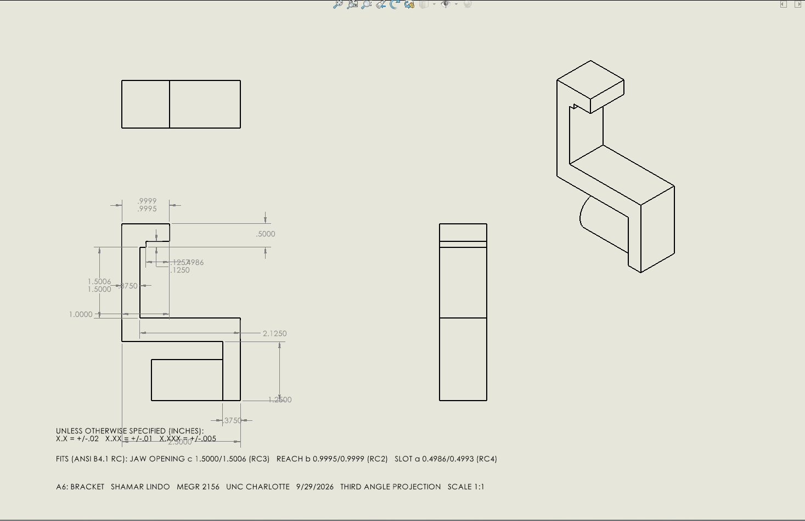

# A6 – Bracket Drawing (Drawings Part 1)

## Objective

Create a fully dimensioned multiview engineering drawing of the A5 Bracket in SolidWorks,
applying third-angle projection, ANSI limit tolerances from RC running-clearance fits, and a
general tolerance block. The drawing communicates all manufacturing information needed to
produce the bracket from the parametric model built in A5.

## Design requirements

| Requirement | Source |
|---|---|
| B-size sheet (17 × 11 in) | Assignment |
| Third-angle projection | ANSI Y14.3 |
| Front, Top, Right, and Isometric views | Assignment |
| All critical dimensions with limit tolerances | Assignment |
| General tolerance block by decimal places | Assignment |
| Title block: name, date, course, scale | Assignment |
| Equation-driven dimension identified | Assignment |

## Parametric Design

The bracket model is driven entirely by SolidWorks equations so that every dimension updates
when any input parameter changes. The table below shows the global variables (inputs) and the
driven dimensions (outputs).

### Global Variables (Inputs)

| Variable | Value | Description |
|---|---|---|
| F | 700 lbf | Applied load |
| SF | 4 | Safety factor |
| Sy | 36,000 psi | Yield strength (A36 steel) |
| E | 29,000,000 psi | Elastic modulus |
| dmax | 0.005 in | Max allowable deflection |
| LA | 1.5 in | Length A (jaw depth / cantilever) |
| LB | 1.25 in | Length B (axial member) |
| LC | 2.5 in | Length C (column height) |
| LD | 1.5 in | Length D |
| LE | 1.0 in | Length E (reach) |
| W | 1.0 in | Width |
| tprac | 0.375 in | Practical minimum thickness |
| step | 0.125 in | Step/fillet increment |
| slotW | 0.4986 in | Slot width (sized for RC4 fit) |
| slotD | 0.125 in | Slot depth |

### Driven (Calculated) Dimensions

| Variable | Equation | Value |
|---|---|---|
| dA | 2 × F × SF / (π × Sy) | 0.875 in |
| hC | F × SF / (Sy × W) | 0.500 in |
| hE | F × SF / (Sy × W) | 0.500 in |
| tB | max(calc, tprac) | 0.375 in |
| tD | max(calc, tprac) | 0.375 in |
| yb | LA − step − tB/2 | 0.8125 in |
| hD | LC + LD | 2.500 in |
| yD | yb + hD | 3.3125 in |
| xl | LE + LC/2 + hC/2 | 2.125 in |

The model has approximately 50 equations. Every sketch is fully defined — no
under-constrained geometry.

### Equation-Driven Dimension

The equation-driven dimension is **dA** (pin-hole diameter). In SolidWorks it is expressed as:

```
"dA" = 2 * "F" * "SF" / (pi * "Sy")
```

This solves the double-shear formula σ = F / (2 × π/4 × d²) ≤ Sy/SF for d. When F, SF, or
Sy changes, dA recalculates automatically and every sketch and feature that references "dA"
rebuilds to match.

## Multiview Drawing

### Third-Angle Projection

The drawing uses third-angle projection (ANSI standard) on a B-size sheet at 1:1 scale:

- **Front view** — bracket profile showing the column, jaw, and base
- **Top view** — directly above front view, showing the slot and pin hole from above
- **Right view** — to the right of front, showing width and pin-hole diameter
- **Isometric view** — upper right corner for 3D context



### Tolerance Specification — RC Fits

Three running-clearance fits were applied per ANSI B4.1 for the mating surfaces on the
bracket:

| Feature | Fit Class | Shaft Limits (in) | Why |
|---|---|---|---|
| Jaw opening c (LA) | RC3 — Precision Running | 1.5000 – 1.5006 | Tight: clamps the workpiece; misalignment concentrates stress |
| Reach bore b (LE) | RC2 — Sliding | 0.9995 – 0.9999 | Sliding: aligns bracket on a locating pin |
| Slot width a (slotW) | RC4 — Close Running | 0.4986 – 0.4993 | Loose: T-slot key slides in/out during setup |

### Tight Tolerance Justification — RC2 on Reach Bore

The reach bore (LE = 1.0 in nominal) uses RC2 because this surface aligns the bracket on
a locating pin or shaft. Misalignment here would cause the jaw to clamp off-centre,
concentrating stress and reducing clamping force. RC2 gives 0.0001–0.0005 in clearance —
enough for assembly without slop.

### Loose Tolerance Justification — RC4 on Slot Width

The slot (slotW = 0.5 in nominal) uses RC4 because the T-slot key slides in and out during
setup. A tighter fit would make insertion difficult; a looser fit would let the bracket rock.
RC4 gives 0.0007–0.0014 in clearance — smooth sliding without excessive play.

### General Tolerance Block

```
UNLESS OTHERWISE SPECIFIED (INCHES):
  X.X    = +/-.02
  X.XX   = +/-.01
  X.XXX  = +/-.005
```

This sets default tolerances by decimal-place precision for every dimension not explicitly
toleranced with limit fits.

## Reflections

this was tough i had to use macros to automate most of the drawing because manually placing
dimensions kept crashing or timing out. the solidworks api is confusing especially for
drawings because you have to convert between model coordinates and sheet coordinates. i spent
most of the time fighting the coordinate system and figuring out which edges to select. the
print to pdf thing was broken too, microsoft print to pdf just froze and made a 0 byte file.
two dimensions (dA and LA) failed to place through the macro even though the edges were
selected. overall i learned a lot about how drawings actually work in solidworks but it was
painful.

## Time Log

| Task | Time |
|---|---|
| Part modeling + equations (from A5) | ~1.5 hr |
| Drawing creation + view layout | ~0.5 hr |
| Macro development for dimensions + tolerances | ~3 hr |
| Debugging coordinate mapping + edge selection | ~2 hr |
| PDF export troubleshooting | ~1 hr |
| Portfolio documentation | ~0.5 hr |
| **Total** | **~8.5 hr** |

## Mistakes

1. **Print to PDF froze** — Microsoft Print to PDF created a 0-byte file and the progress
   dialog became completely unresponsive. Switched to File → Save As → PDF.
2. **dA dimension failed** — The macro could not select the pin-hole edges in the right view.
   Both edge selections returned False.
3. **LA dimension failed** — Edges selected successfully (True, True) but AddDimension2
   returned Nothing. Likely a view-activation issue in the API.
4. **slotW/slotD overlap** — One edge selection failed for each dimension, causing garbled
   overlapping text on the drawing.
5. **Coordinate mapping** — Had to derive the conversion SX(x) = CX + (x + 0.875) × 0.0254
   from the front view position. Took multiple iterations to get right.

## Lessons Learned

- SolidWorks drawing API uses sheet-space coordinates in meters even when the part is in
  inches. Every model coordinate must be converted through the view's Position property.
- `Create3rdAngleViews` places front/top/right automatically but the returned view positions
  do not always match expectations — read them back from the view's Position property.
- `AddDimension2` silently returns Nothing when the wrong view is activated or the selection
  set does not match what it expects. Always check the return value.
- Microsoft Print to PDF can deadlock on SolidWorks drawings. Use `Extension.SaveAs3` with
  the PDF export data object instead.
- Naming equation variables with quotes in SolidWorks (`"dA"`) is required — they will not
  resolve without them.

## Appendix

### CAD Download

- [A6_Bracket.SLDPRT](../../../cad/A6_Bracket.SLDPRT) — parametric part file
- [A6_Bracket.SLDDRW](../../../cad/A6_Bracket.SLDDRW) — multiview drawing
